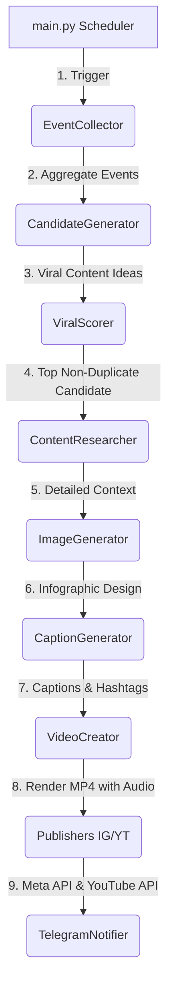

# BiscoFootball AI Automation

**Fully automated AI football network. Gathers trends, scores with ChatGPT, generates infographics/reels via Playwright + FFmpeg, and uploads to Instagram/YouTube.**

<p align="center">
  
</p>

> [!IMPORTANT]
> **Zero-Cost Automation (Our USP)**: By using Playwright to automate ChatGPT directly in the browser instead of calling paid API endpoints, this entire pipeline operates at **100% zero running cost**. You can scale and automate uploading up to **50+ Reels/Shorts per day completely free** (using a standard ChatGPT account or free trial).

BiscoFootball AI Automation is a fully automated, schedule-driven content creation and publishing pipeline for football content networks. The system gathers trending news, player statistics, and historical football records, uses AI to research and score content for virality, designs infographic cards, compiles video reels/shorts with dynamic audio, uploads them to Instagram and YouTube, and offers a complete remote control system via Telegram.

---

## System Architecture & Flow

The system runs on a scheduler loop (default: every 30 minutes) executing the following workflow:



1. **Collect**: Aggregates raw news, statistics, and trends from API-Football, Google Trends, Reddit (r/soccer), and RSS feeds.
2. **Candidates**: Generates multiple content ideas from the raw events.
3. **Score**: Sends candidate topics to ChatGPT (via Playwright) to evaluate them on curiosity, shock factor, shareability, historical significance, and debate potential. Only ideas exceeding the threshold (e.g., `7.0`) proceed.
4. **Research**: ChatGPT researches the selected topic to extract verified facts, comparisons, and statistics.
5. **Image**: Generates a professional sports infographic card (aspect ratio 3:4) using ChatGPT/DALL-E.
6. **Caption**: Generates captions (short/long options) and matching hashtags.
7. **Video**: Uses FFmpeg to build a 6-second high-definition vertical video reel (1080×1350) with subtle zoom animations and a random audio track from the music folder.
8. **Publish**: Automatically uploads the media and details to Instagram (Reels or Feed) and YouTube Shorts.
9. **Notify**: Reports previews, status updates, generated logs, and publication links directly to your Telegram chat.

---

## Features

- 🔄 **Fully Automated Pipeline**: Continuous scheduled execution that can run 24/7.
- 🧠 **AI-Powered Virality Filter**: Selects only the absolute best topics to build engagement.
- 🎨 **Dynamic Media Generation**: Rich sports infographics and short-form video reels created on the fly.
- 📱 **Social Media Integrations**: Direct publishing to Instagram and YouTube Shorts.
- 🤖 **Telegram Control Center**: Use commands to trigger manual runs, skip tasks, view logs, query collected news, or feed manual content ideas directly to the system.
- 💾 **Smart Cooldown & Deduplication**: Prevents repeating topics within 30 days.

---

## Prerequisites

Before running the application, make sure you have:

1. **Python 3.10+** installed on your system.
2. **FFmpeg**: Required for video rendering and audio mixing.
   - **Windows**: Install via Scoop (`scoop install ffmpeg`) or Chocolatey (`choco install ffmpeg`), or download the binary from the official site and add it to your System PATH.
   - **macOS**: Install via Homebrew (`brew install ffmpeg`).
   - **Linux**: Install via apt (`sudo apt install ffmpeg`).
3. **Playwright Web Browser Engines**: Automated chromium browser context.

---

## Installation & Setup

1. **Clone the repository**:
   ```bash
   git clone https://github.com/YOUR_GITHUB_USERNAME/BiscoFootball-Automation.git
   cd BiscoFootball-Automation
   ```

2. **Set up a Virtual Environment**:
   ```bash
   python -m venv venv
   # On Windows:
   venv\Scripts\activate
   # On macOS/Linux:
   source venv/bin/activate
   ```

3. **Install Dependencies**:
   ```bash
   pip install -r requirements.txt
   ```

4. **Install Playwright Browser Drivers**:
   ```bash
   playwright install chromium
   ```

5. **Configure Environment Variables**:
   Copy `.env.example` to `.env` and fill in your custom API keys, IDs, and credentials.
   ```bash
   cp .env.example .env
   ```

---

## Manual ChatGPT Authentication Helper

Because ChatGPT implements bot detection and 2FA, the system uses a persistent browser profile. You must perform a manual login once before starting the automatic runner.

1. Run the login helper script:
   ```bash
   python login_chatgpt.py
   ```
2. A non-headless Chromium window will open. Go ahead and log in manually to your ChatGPT account (complete 2FA/CAPTCHA if prompted).
3. The script will wait until it detects a successful login (the prompt text area is loaded), save the cookies/profile state to `data/chatgpt_session/chrome_profile`, and close automatically.

---

## Usage Guide

Execute the main orchestrator script with python:

### 1. Default (Scheduler + Telegram Bot Listener)
Runs the scheduler loop and starts the Telegram control bot.
```bash
python main.py
```

### 2. Immediate Run Once
Triggers the pipeline immediately to generate and publish one round of content, then exits.
```bash
python main.py --run
```

### 3. Dry Run / Test Mode
Runs the entire pipeline immediately but disables publishing to Instagram and YouTube (useful for testing media outputs locally).
```bash
python main.py --test
```

---

## Telegram Control Bot Commands

If `ENABLE_TELEGRAM_BOT` is enabled, you can send the following commands directly to your Telegram bot:

- `/start` - Shows the current system status and configurations.
- `/status` - Queries what task the pipeline is currently executing.
- `/run` - Manually triggers the pipeline immediately.
- `/skip` - Aborts the current step in the pipeline.
- `/news` - Fetches and displays the raw researched events from the current collection phase.
- `/logs` - Retransmits the last 20 lines of the system log.
- `/upload` - Re-attempts uploading the latest rendered video/image to social platforms.
- `/man <topic>` - Feeds a custom topic manual override (e.g., `/man Messi vs Ronaldo World Cup comparison`). The bot will instantly run the pipeline using your exact input, bypass the viral threshold check, and publish immediately.

---

## Configuration Settings

You can customize execution and toggle systems inside `config.py`.

### Feature Toggles
| Flag | Description |
| :--- | :--- |
| `ENABLE_FOOTBALL_API` | Toggles fetching stats from API-Football. |
| `ENABLE_GOOGLE_TRENDS` | Toggles Google Trends scraping. |
| `ENABLE_REDDIT_SCRAPING` | Toggles fetching top posts from soccer subreddits. |
| `ENABLE_RSS_FEEDS` | Toggles parsing football RSS feeds. |
| `ENABLE_CHATGPT_SCORING` | Toggles AI viral scoring. |
| `ENABLE_VIDEO_GENERATION`| Toggles compiling infographic into MP4 reels via FFmpeg. |
| `ENABLE_INSTAGRAM_UPLOAD`| Enables publishing to Instagram using Meta API. |
| `ENABLE_YOUTUBE_UPLOAD`  | Enables publishing YouTube Shorts via YouTube API. |
| `ENABLE_TELEGRAM_BOT`    | Starts the interactive control bot listener. |

### Video Customization
- Adjust duration (default: `6` seconds), aspect ratio, video framerate, and zoom animations directly in `config.py` (variables: `VIDEO_DURATION_SECONDS`, `ZOOM_START`, `ZOOM_END`).
- Populate your background audio tracks in `content/music` (the system picks a random `.mp3` file to overlay during rendering).

---

## Repository Structure

```text
├── config.py              # Central application settings and toggles
├── main.py                # Main loop, scheduler, and orchestrator
├── login_chatgpt.py       # One-time ChatGPT authentication script
├── requirements.txt       # Dependencies manifest
├── prompt.md              # Original prompt specifications
├── .gitignore             # Git excluded directories and secrets
├── .env.example           # Configuration template
└── modules/               # Core pipeline modules
    ├── __init__.py
    ├── candidates.py      # Candidate generator
    ├── caption.py         # ChatGPT caption writing module
    ├── chatgpt_browser.py # Playwright automation engine
    ├── chatgpt_image.py   # DALL-E image crawler
    ├── collector.py       # Aggregator for news and stats APIs
    ├── dedup.py           # Deduplication checker
    ├── notifier.py        # Log and Telegram message router
    ├── publisher_ig.py    # Instagram API publisher
    ├── publisher_yt.py    # YouTube API publisher
    ├── researcher.py      # ChatGPT-based topic researcher
    ├── scorer.py          # ChatGPT-based virality evaluator
    ├── telegram_bot.py    # Telegram command listener and handlers
    └── video.py           # FFmpeg video renderer
```

---

## License

This project is open-source. Please check local API terms of use for ChatGPT, Meta Graph API, and YouTube API.
